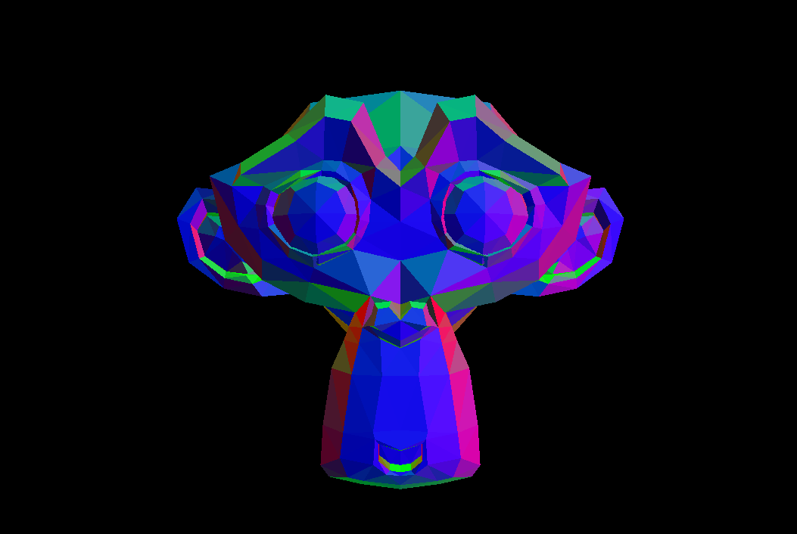

# 3p 🖼️ Lab 4: Shaders II (Entrega dia de clase)

Rasterizer using python and PyOpenGL as main library.

## 🚀 How to execute it?

Simply run the next commands:

```bash
pip install -r requirements.txt
```

``` bash
python app.py
```

ℹ️ Remember to use `32-bit` python version.

> - 🧠 Using CTRL+C you can get the camera coordinates.

## 🎭 Show off





## 🫠 Who I am?

[Samuel A. Chamalé](https://github.com/chamale-rac) - Human

Guatemala, 2023
