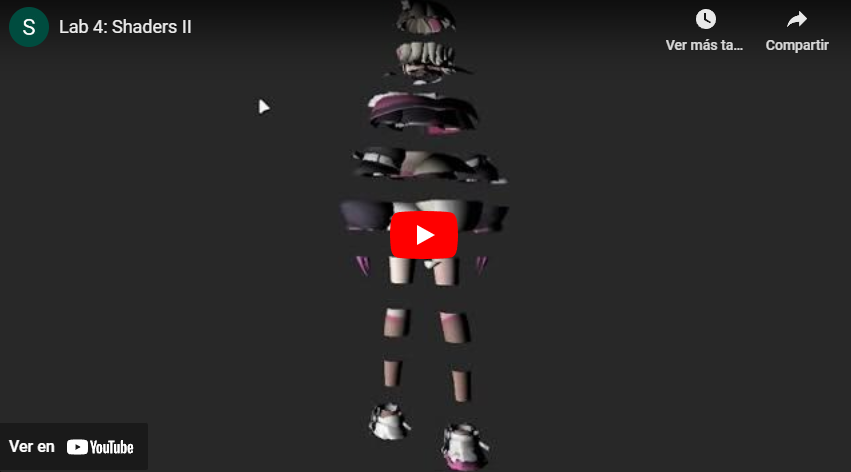

# 3p 🖼️ Proyecto 3: OpenGL

Final project using python and PyOpenGL as main library.

## 🚀 How to execute it?

Simply run the next commands:

```bash
pip install -r requirements.txt
```

``` bash
python app.py
```

ℹ️ Remember to use `32-bit` python version.

## ⚠️ Shortcuts - Inputs

### 🎥 Camera

| Input | Executed action |
|-|-|
| Mouse pressed | Vertical and horizontal movement  |
| Mouse wheel | Zoom in-out |

    🧠 Be careful, movement have acceleration!

### 🪖 Shaders

| Input | Executed action |
|-|-|
| 1 | Basic Shader  |
| 2 | Party Shader |
| 3 | Toon Shader |
| 4 | Cutted Shader |
| 5 | Pixelate Shader |
| 6 | Reflection Shader |
| 7 | Refraction Shader |
| a, w, s, d | Interact with shaders |
| r | Reset interaction values |

### 🦴 Models
| Input | Executed action |
|-|-|
| u | Mococo 3D model |
| i | Prisma 3D model |
| o | Chicken (cute) 3D model |
| p | Barn 3D model |
| 0 | No 3D model |

### 🌤️ Skyboxs
| Input | Executed action |
|-|-|
| j | Lake Skybox |
| k | Winter Skybox|
| l | Night Skybox |
| h | No Skybox |

### Others...
| Input | Executed action |
|-|-|
| f | toggle fill mode

## 🎭 Show off

[](https://youtu.be/TLdDNpvljhk?si=Cjji1Qc1GCR6L755)

## 🫠 Who I am?

[Samuel A. Chamalé](https://github.com/chamale-rac) - Human

Guatemala, 2023
