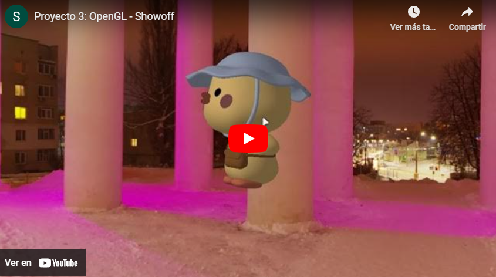

# 3p 🖼️ Lab 4: Shaders II (Entrega dia de clase)

Rasterizer using python and PyOpenGL as main library.

## 🚀 How to execute it?

Simply run the next commands:

```bash
pip install -r requirements.txt
```

``` bash
python app.py
```

ℹ️ Remember to use `32-bit` python version.

## 🧠 Shortcuts

- A or D to rotate model in y axis.
- Arrow UP or DOWN to speed up or down the rotation speed.
- F toggle fill mode.
- R to toggle auto rotation.
- Mouse left click will allow you interact with the shaders. Use Z to reset the interaction values.
- 1, 2, 3, 4, 5 to change between shaders.

## 🎭 Show off

[](https://youtu.be/BXB8RenhN1c?si=G4UWVdl8jQAEqPQk)

## 🫠 Who I am?

[Samuel A. Chamalé](https://github.com/chamale-rac) - Human

Guatemala, 2023
